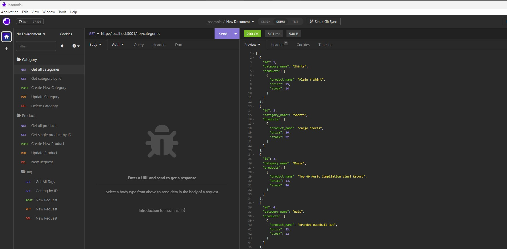

# E-commerce Back End

Command Line application to test api routes for e-commerce database

## Description

The purpose of this project was to create api routes to perform RESTful CRUD operations for the back end of an e-commerce application

## Installation

N/A

## Usage

The e-commerce backend contains routes that allow user to perform RESTful CRUD operations to the category, product, and tag tables of an e-commerce database.  A user can test these routes  by typing npm start in the application directory in a command line terminal and entering the various route requests inside of Insomnia.

## Credits

N/A

## License

Please refer to the LICENSE in the repo.
